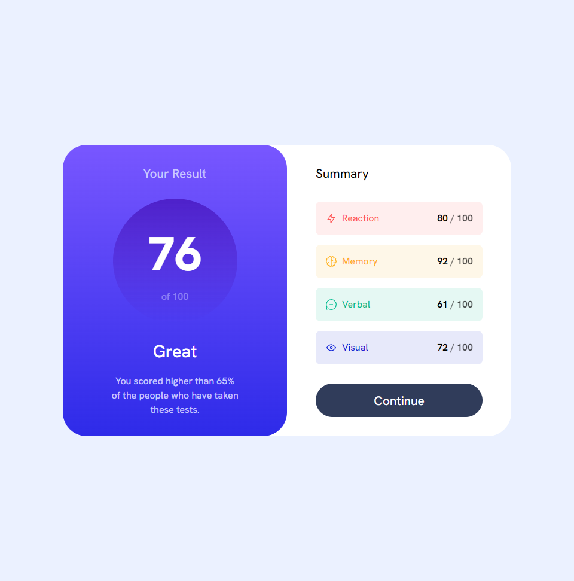
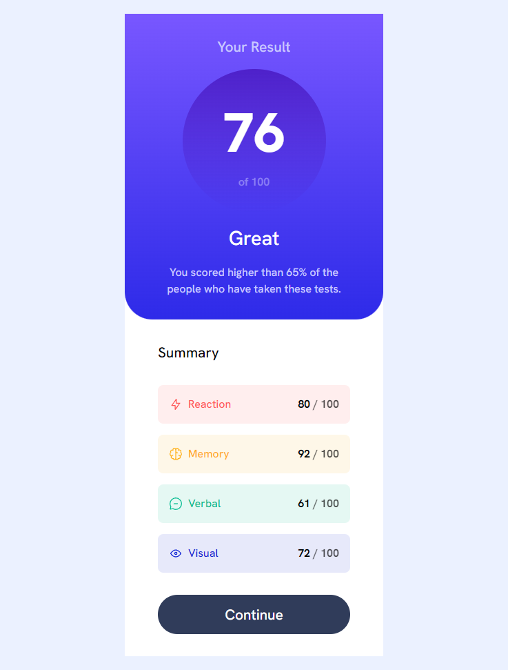

# Frontend Mentor - Results summary component solution

This is a solution to the [Results summary component challenge on Frontend Mentor](https://www.frontendmentor.io/challenges/results-summary-component-CE_K6s0maV). Frontend Mentor challenges help you improve your coding skills by building realistic projects. 

## Table of contents

- [Frontend Mentor - Results summary component solution](#frontend-mentor---results-summary-component-solution)
  - [Table of contents](#table-of-contents)
  - [Overview](#overview)
    - [The challenge](#the-challenge)
    - [Screenshot](#screenshot)
    - [Links](#links)
  - [My thought process](#my-thought-process)
      - [Atomic ccs](#atomic-ccs)
      - [Javascript](#javascript)
    - [Built with](#built-with)
    - [Useful resources](#useful-resources)
  - [Author](#author)
  - [Acknowledgments](#acknowledgments)


## Overview

### The challenge

Users should be able to:

- [x] View the optimal layout for the interface depending on their device's screen size
- [x] See hover and focus states for all interactive elements on the page
- [x] **Bonus**: Use the local JSON data to dynamically populate the content

### Screenshot




### Links

- Live Site: [here](https://jabrayilzadeali.github.io/results-summary-component-by-frontendmentor/)
- Frontendmentor Profile: [here]()

## My thought process

#### Atomic ccs

This time I wanted to experiment with atomic css. If you don't know atomic css is it is the approach to CSS architecture that favors small, single-purpose classes with names based on visual function. For Example:

`html`
```html
<div class="flex flex-col align-center">
  <h1 class="text-lg clr-white">Heading</h1>
  <p class="clr-grey">Sub Text</p>
</div>
```

`css`
```css
.flex {
  display: flex;
}

.flex-col {
  flex-direction: column;
}

.align-center {
  align-items: center;
}

.text-lg {
  font-size: 1.5rem;
}

.clr-white {
  color: white;
}

.clr-grey {
  color: grey;
}
```

---

So at first it was hard to name things, I didn't know to write html first or css, but then I created some predefined classes like color(.clr), or background-color (.clr-...-bg) font sizes paddings etc. Slowly started to add classes into html and then if I made a mistake both finding the bug and fixing that become a lot easier.

---

if I have used `\` in order to get classnames with dots like `p-.5` this className works in html, but in css you should use `p-\.5` otherwise css try to find a class after the dot. Let's see an example

```html
<p class="p-.5">Text</p>
```
```css
.p-\.5 {
  padding: .5rem;
}
```

---

In order to use responsive mode like in big screen use to column in `grid` I use media queries. I use `p-md-5` in medium screen size or in large screen size `p-lg-5` etc.

In Below example in small screen size padding first will be 2rem, but after width become bigger than 768px `.p-md-5` will take affect and padding will be 5rem;

`html`
```html
<p class="p-2 p-md-5">Text</p>
```

`css`
```css
.p-2 {
  padding: 2rem;
}

@media screen and (min-width: 768px) {
  .p-md-5 {
    padding: 5rem;
  }
}
```

---

Also whenever you use `px-5` or `py-5` make sure you use `padding-top` and `padding-bottom` properties seperately instead of using `padding: 5rem 0`. Let me explain why

`html`
```html
<p class="px-5 py-2">Text</p>
```

here first it will apply add padding to the right and left and removes padding from top and bottom, but when you want add padding top and bottom as well(`2rem`) it also removes previously defined padding on the sides so this doesn't work with multiple paddings like this.

`css`
```css
.px-5 {
  padding: 0 5rem;
}

.py-2 {
  padding: 2rem 0;
}
```

In order to work this you should individually add to the paddings to the top, bottom, right and left without removing the any padding.

`css`
```css
.px-5 {
  padding-top: 5rem;
  padding-bottom: 5rem;
}

.py-2 {
  padding-right: 2rem;
  padding-left: 2rem;
}
```

This way we don't override the previous paddings it works.

---

#### Javascript

And in the javascript in order to select element I used `data-*` attribute in the html. Instead of selecting elements using just css classnames I used data attribute for selecting elements. Because those classNames doesn't represents actual content in css they always can change. Besides, atomic css is meant to used write quality css classes, that they can used over the project not just single use. So selecting elements by css classnames out of option otherwise there will be potentially misselecting elements in js.

```html
<div data-stats class="flex flex-col gap-1"></div>
```

```js
const stats = document.querySelector("[data-stats]");
```

I also knew they didn't defined classesNames in data.json. So I created seperate array of json and then combine them.

```js
import data from "../data.json" assert { type: 'json' };
const stats = document.querySelector("[data-stats]");

const statsClasses = [
    {
        statName: "Reaction",
        classes: ["clr-light-red", "clr-light-red-transparent-bg"]        
    },
    {
        statName: "Memory",
        classes: ["clr-orangey-yellow", "clr-orangey-yellow-transparent-bg"]
    },
    {
        statName: "Verbal",
        classes: ["clr-green-teal", "clr-green-teal-transparent-bg"]
    },
    {
        statName: "Visual",
        classes: ["clr-cobalt-blue", "clr-cobalt-blue-transparent-bg"]
    }
]

// if category_name equal statname then and that classes to that json file
data.map(({ category }, index) => {
    statsClasses.forEach(({ statName, classes }) => {
        if (category === statName) {
            data[index]["classes"] = classes;
        }
    })
})
```

Based on this I add class names exactly where I wanted to be. Probably there is better way of combining these. Anyway I will refactor it later :).

---

Then I added data to the dom
```js
let code = "";
data.forEach(({category, score, icon, classes}) => code += `
    <div class="p-1 rounded-.5 flex justify-between ${classes[1]}">
        <div class="flex gap-.5">
            
            <h2 class="${classes[0]}">${category}</h2>
        </div>
        <p class="font-bold">${score} <span class="clr-dark-gray-blue opacity-70">/ 100</span></p>
    </div>
`)
stats.innerHTML = code;
```

--- 

I really like using atomic css it was really fun way to write css and at the end understanding my css is now a lot simpler also.


### Built with

- Semantic HTML5 markup
- CSS custom properties
- Flexbox
- CSS Grid
- Mobile-first workflow
- Atomic Css

### Useful resources

- [Tailwind Css](https://tailwindcss.com/) - This helped me for finding good class names and overall how to make a good css architecture


## Author

- Frontend Mentor - [Jabrayilzade Ali](https://www.frontendmentor.io/profile/jabrayilzadeali)
- Twitter - [Jabrayilzade Ali](https://twitter.com/JabrayilzadeAli)

## Acknowledgments

Thank you frontendmentor for providing this callenge!

